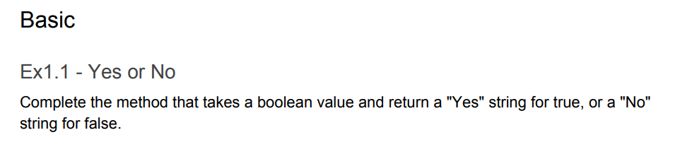

# js-questions
<h2>js-questions</h2>
this project contains 25 questions in <strong>JS</strong>.
<h4>Subjects:</h4>
<ul>
<li>loops- for, forEach, map, while</li>
<li>Arrays + methods</li>
<li>Conditions, terneri</li>
</ul>

<h5>link to the questions:</h5>
</img>
</img>
</img>
</img>
</img>
</img>
</img>
</img>
</img>
</img>
</img>